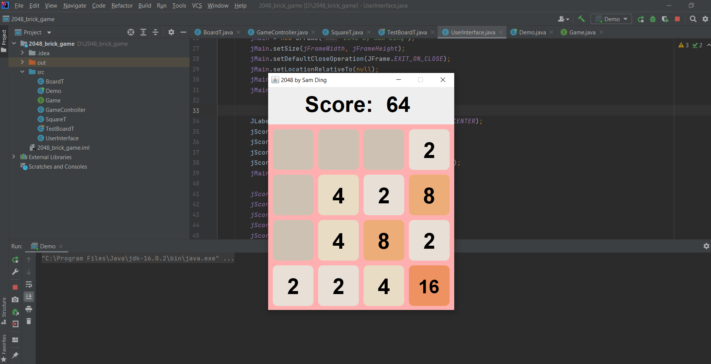

# 2048

## Personal Infos
- Name: Jianlan Ding
- email: dingj29@mcmaster.ca
- user dingj29
## About 2048
- It's a type of “sliding block puzzle”.
- The game's objective is to slide numbered tiles on a grid to combine them to create a tile with the number 2048.

## Usage (Interaction with User)
| Command  | Description  |
|---|---|
| LeftArrow | To slide all numbered tiles to left hand side and try to combine them to created new tiles |
| RightArrow  | To slide all numbered tiles to right hand side and try to combine them to created new tiles |
| UpArrow  | To slide all numbered tiles upwards and try to combine them to created new tiles |
| DownArrow  | To slide all numbered tiles downwards and try to combine them to created new tiles |

## Platform & Software
- OS: Windows 10
- IntelliJ IDEA
- Projects are built using Java & Java Swing and are developed using IDEA
- Developed user interface using Java Swing GUI and modules using  MVC design pattern

