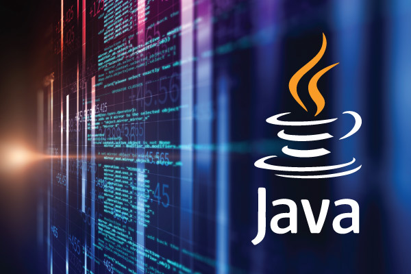
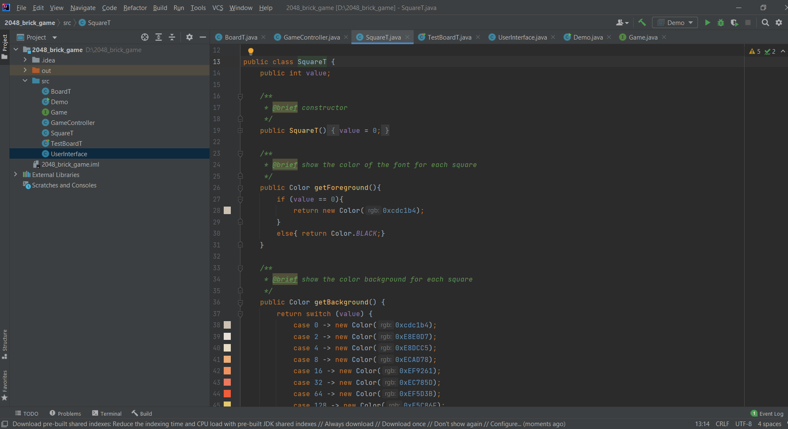

# Java Programming

## Personal Infos
- Name: Jianlan Ding
- email: dingj29@mcmaster.ca
- user dingj29
## About Java
- Java is a popular programming language.
- Java is a high-level, class-based, object-oriented programming language.
- Java platform consists of the JDK, JVM, and JRE.
- Java code can run on any machine that has a Java Virtual Machine (JVM) on it.
- JDK - Java developing kit allows developers to create Java programs that can be executed and run by the JVM and JRE. (JDK 18)
- JRE - Java runtime environment is the on-disk part of Java that creates the JVM, can be used as a standalone component 
           to simply run Java programs, but it's also part of the JDK. 
- JVM - Java virtual machine is the Java platform component that executes programs.
- Java SE 18 (https://docs.oracle.com/en/java/javase/18/docs/api/allclasses-index.html)

## Platform & Software
- OS: Windows 10
- IntelliJ IDEA
- MinGW 64-bits
- Projects are built using Java & Java Swing and are developed using IDEA

